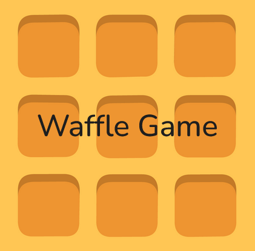

# WaffleGame Java Project

**This Project was made in collaboration with:** 
Pedro Silva 

## About

Waffle game made in java to help understand key topics of the programming language

## What we learned
 - Algorithms
 - Programming language
 - Memory and data types
 - Control of execution (basic instructions, conditionals, and loops)
 - Procedural abstraction
 - Data abstraction
 - Classes, objects, attributes, and methods
 - Assertions and contracts
 - Exceptions
 - Input and output of data via standard input and output and through files
